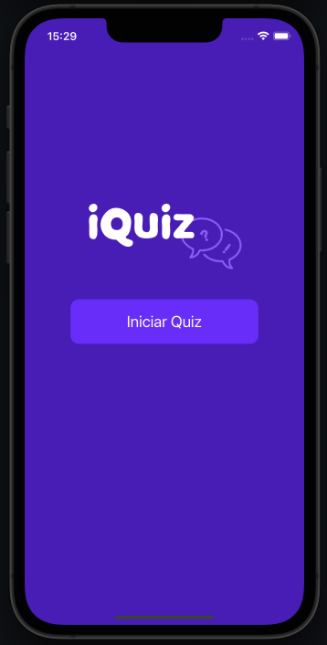
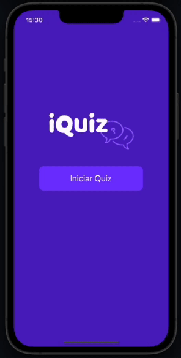

# iQuizHP

iQuiz.gif

<h4 align="center">
    
</h4>

## Sobre

Este projeto foi desenvolvido atraves das aulas do Alura para conhecimentos basicos de Swift iOS.

Layout do projeto [Figma]([https://www.figma.com/file/2MFqqfpgUWbwqBcsq5aLko/SNEAKERS-HEADS---SHOP?node-id=0%3A1&t=1cCWDlIfZo9Ler0r-1](https://www.figma.com/file/arNzZp0KyM55CKpvlZjUOL/iQuiz?type=design&node-id=0-1&mode=design))

-------------

## 📷 Resultado

<h1 align="center">
     
</h1>
